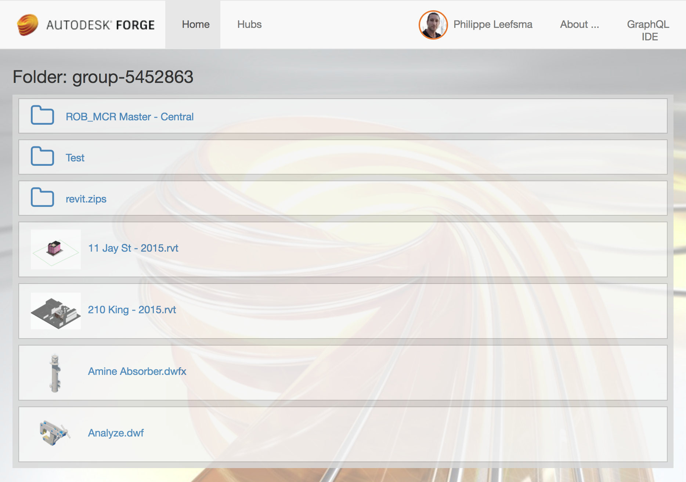

# Forge QL

## Description

A GraphQL wrapper server/client demo around Autodesk Forge Web API's

## Prerequisites

To run this samples, you need your own Forge API credentials:

 * Visit the [Forge Developer Portal](https://developer.autodesk.com), sign up for an account
 * [Create a new App](https://developer.autodesk.com/myapps/create)
 * For this new App, you can use <b>http://localhost:3000/api/forge/callback/oauth</b> as Callback URL.
 * Take note of the <b>Client ID</b> and <b>Client Secret</b>, those are your API keys that must remain hidden
 * Install the latest release of [NodeJS](https://nodejs.org)
 * Clone this or download this project. It's recommended to install a git client such as [GitHub desktop](https://desktop.github.com/) or [SourceTree](https://www.sourcetreeapp.com/)
 * To clone it via command line, use the following (<b>Terminal</b> on MacOSX/Linux, <b>Git Shell</b> on Windows):

    > git clone https://github.com/leefsmp/forge-ql

## Project Setup

   In **development**, the client is dynamically built by the
   [webpack-dev-middleware](https://github.com/webpack/webpack-dev-middleware), so just run:

    * `npm install`    *(downloads project dependencies locally)*

    * `NODE_ENV=development HOT_RELOADING=true npm start`      *(builds client on the fly and run server)*

    * open [http://localhost:3000](http://localhost:3000) in your favorite browser

   In **production**, the client requires a build step, so run:

    * `npm install` *(not required if you already run at previous step)*

    * `npm run build-prod && NODE_ENV=production npm start` *(builds client and run server)*

    * open [http://localhost:3000](http://localhost:3000) in your favorite browser

* To see your project open your browser `http://localhost:3000`

## Live Demo

[https://forge-ql.autodesk.io](https://forge-ql.autodesk.io)

 

## License

[MIT License](http://opensource.org/licenses/MIT)

## Written by

Written by [Philippe Leefsma](http://twitter.com/F3lipek)

for Forge Partner Development - [http://forge.autodesk.com](http://forge.autodesk.com)